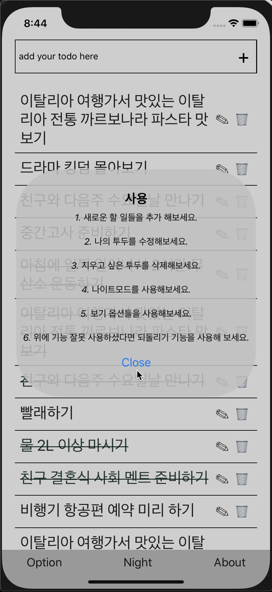

# TodoAppProject

기억 해야 할 일 밑 할 일들을 간편하게 저장할수 있는 투두 어플리케이션.
기술 요악: React-Native와 Redux를 기반으로 구현.

구현 기능:
1. 투두 생성.
2. 투두 수정.
3. 투두 삭제(끝난 일, 할 일, 모든 일 그룹 삭제 가능)
4. 보기 옵션 기능.
5. 나이트 모드 구현.
6. 되돌리기 기능 구현.
7. 로컬 저장 기능 구현.

데모 영상

